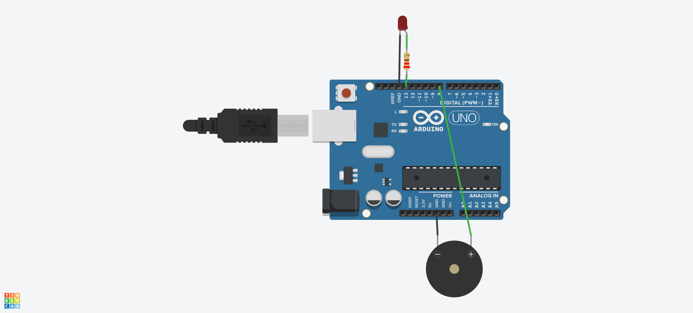

# 🚀 Arduino Morse Transmitter

**Translates text to Morse code with dual sensory output - visual (LED) and audible (piezo buzzer).**  
Perfect for learning telegraphy, wireless communication demos, or accessibility projects!

  
*Circuit design created with TinkerCAD Online*

## ✨ Features
- **Dual-Channel Output**  
  - 📶 Visual signals via built-in LED (pin 13)
  - 🔊 Audible tones via piezo buzzer (pin 8)
- **Real-Time Translation**  
  - Serial monitor input processing
  - Instant Morse conversion
- **Adjustable Timing**  
  - Configurable transmission speed
  - Customizable tone frequency
- **Full Character Support**  
  - All alphanumeric characters (A-Z, 0-9)
  - Space-aware word separation

---

## 🎮 Interactive Simulation
  
Explore the virtual prototype before building the physical circuit!
